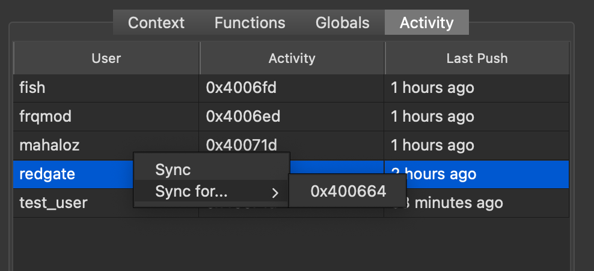

# UI Guide

It's a good idea to start here before going to any other use-page so you understand all the features BinSync has to offer and how to access them.

## The Core Basics
BinSync works on Git, which means that everything is version-controlled, and nothing is automatically changed in your local client. 
If you followed the [Joining a Project](/quickstart/joining-project) page, then you should already understand that you request specific users content. 

### Syncing: No Pulling, No Pushing
You may be thinking that when you click `Sync`, it's like you are pulling, but that is not really the case. Under the hood we have a thread going that is doing real `pulling` and `pushing` on the Git level to update your Git's knowledge of users. This makes more sense if you look at how users are stored in the BinSync database. 

Taking a look at the example repo, [mahaloz/binsync_example_repo](https://github.com/mahaloz/binsync_example_repo/), you will notice every user is actually a branch based on the initial `binsync/__root__` which has no changes:

```bash
$ git branch

  binsync/__root__
  binsync/fish
  binsync/frqmod
  binsync/mahaloz
  binsync/redgate
  binsync/test_user
  main
```

When you connect on your own user, we push and pull in another thread at any given time since you are your own branch. Syncing is a higher level action that actually just copies over data from a branch already present on your computer.

### No Pushing
BinSync is smart enough to not ask you to push specific functions. BinSync will auto push changes you make to your local artifacts into your branch and up to the Git repo. This also means that only changes that happen while BinSync is on will make it into the repo. Let me repeat that: **only BinSync observed changes are saved**. In the future we will support force pushing for joining a project late with an already reversed binary. 

## Understanding the GUI
The `Info Panel` is the singular place where you will get information about the BinSync database and the actions you can perform on your local database. 

On the bottom of the `Info Panel`, there is text on the right and left.


The text on the left is your current Context, which we will explain in the [Context](#context) Tab section.

The text on the right is the user you are connected as and the connection status, depicted with three colors:
- Green: Connected to a BinSync repo and able to pull and push to remote
- Yellow: Connected to a BinSync repo but unable to pull or push to remote (either because your repo has no remote or you have limited permissions on the remote repo)
- Red: Not connected to a BinSync repo

Yellow can occur when you create a local repo and don't connect a remote url to that repo.

There are five tabs which separate the type of info you can get from BinSync: `Context`, `Functions`, `Globals`, `Activity`, and `Utilities`. Each tab has a table which you can right-click to do actions.

**Note on addresses:** if you've loaded a binary with a base address offset, you may notice that the addresses of artifacts in your decompiler don't match those in the BinSync panel. By design, BinSync displays offset-normalized addresses.

### Context
The Context tab is likely to be the tab you use the most. The Context tab is always associated with a context, which is the current function you are looking at. In the above image, I was looking at `mahaloz_main`. The context changes any time you click on a function. 

The table shows users who have made a change to the function you are currently looking at. Right-clicking on a user gives you the ability to `Sync` from them. Note: users who only `Sync` that same function from others will not be shown on the table. 

### Functions
The Functions tab is likely the tab you will look at first when you open a new BinSync project that others have worked on. The table shows you _all_ the functions in the Binary that have been modified by at least one person. You can look at this to see what the group has started reversing. 


Right-clicking on row give you the ability to do two things:
1. Sync from the currently displayed user (the last person to change it) for that specific function
2. Sync from some other user that has changed that same function at some time before the currently displayed user.

### Globals
The Globals tab shows things that can't be associated to a function. This includes Structs, Global Variables, Enums. 


Similarly to the Functions tab, you can sync either from the displayed person or some other person that has made a change in the past.

The "T" column indicates the type of global:
- S: Struct
- T: Typedef
- E: Enum
- V: Variable

### Activity
The Activity tab shows you people who are assumed to be actively reversing the Binary right now. This will show you a table of any user that has made a change in the last 2 hours to something in their binary. 



Like all other tabs, you can sync either from the displayed person and artifact or from some other person.

### Utilities
The Utilities tab shows different options for BinSync. Here you can change BinSync's sync behavior and perform Magic Syncs (replace local artifacts with artifacts from the BinSync repo) and Force Pushes (push all of your artifacts to the BinSync repo). You can also turn on Auto Fast Sync, which automatically replaces your decomipler's auto-generated function names with names from the BinSync repo. 

---

Now that you know how things work, you can checkout our example workflows.

## Known Issues
### My BinSync is not auto-pushing things, wtf?
This usually happens when you don't have an ssh key associated with the repo you are trying to edit, or that key is not password unlocked. Make sure the key you are using is not locked or BinSync wont be able to use it.

### Git Error
If you ever get a Git Error, you may get a stack trace ending in:
```python
# [truncated]
    self.tree = Tree(self.repo, hex_to_bin(readline().split()[1]), Tree.tree_id << 12, '')
binascii.Error: Non-hexadecimal digit found
```

This means BinSync crashed while trying to commit something. Many things could have gone wrong here. Often the easiest way to fix this is just restarting your decompiler (so you can reload BinSync).

If possible, copy the **full** stack trace with the error that likely came right before this error (which caused it), and file an [Issue](https://github.com/angr/binsync/issues).
